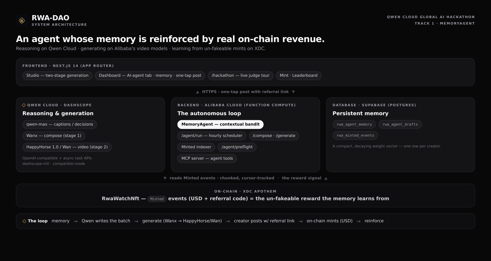
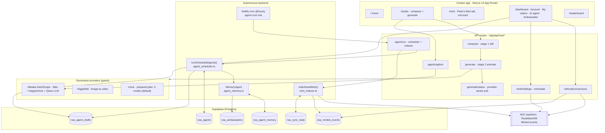
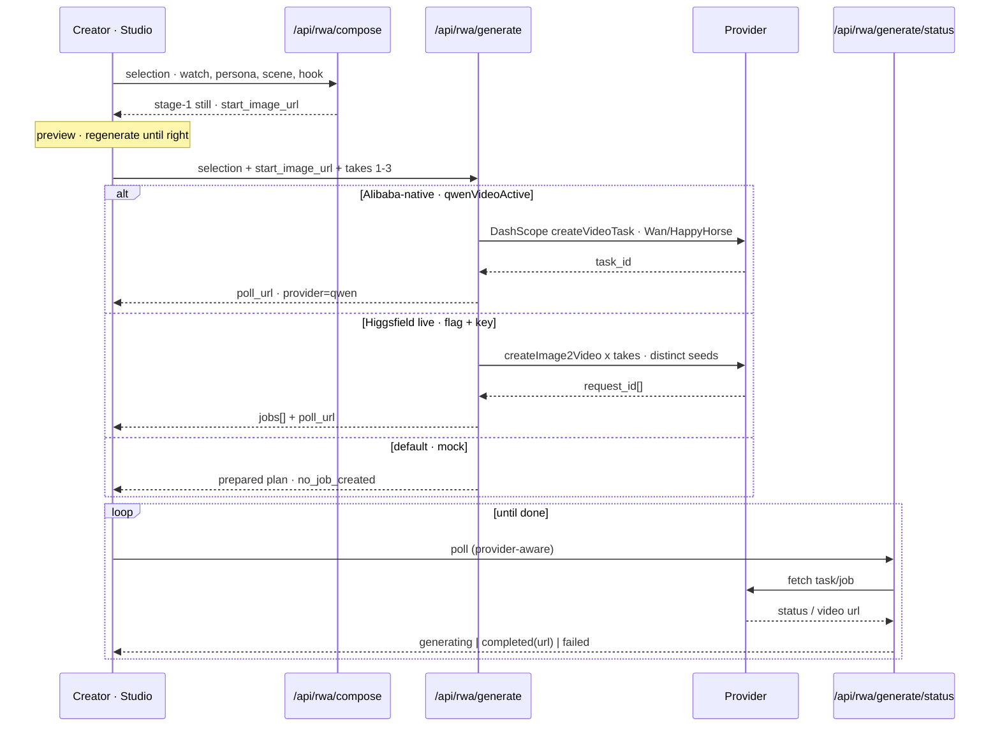
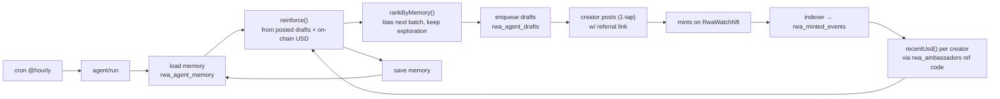
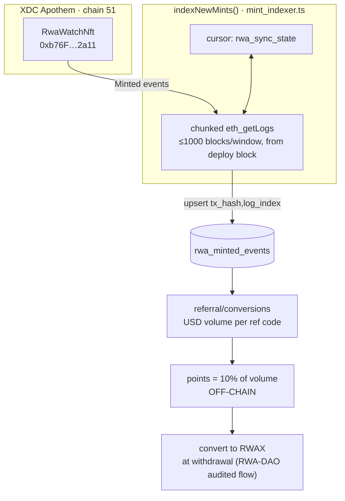

# RWA-DAO — System Architecture

How the platform fits together: the creator-facing app, the two-stage video pipeline, the
autonomous **MemoryAgent** loop, and the on-chain truth signal that feeds it. The overview image
above is the submission diagram; the sections below break it down with GitHub-native Mermaid, and
file paths point at the real code so this stays honest.

> **Reading guide.** Solid arrows are request/data flow. Everything Alibaba-native (the
> hackathon-qualifying path) is called out explicitly. Nothing here is aspirational — where a path
> is gated behind a flag or a key, the diagram says so.

---

## 1. System overview

**Key boundary:** the app is safe by default. With no provider flag set, `/api/rwa/generate`
returns a fully prepared render plan and **never calls a provider or burns a credit**. Live
generation is a deliberate flip (`RWA_ALLOW_LIVE_GENERATION=1` + a provider key).

---

## 2. Two-stage generation pipeline

We **compose the scene first** (a still "plate" of the exact watch in the exact setting), let the
creator preview/regenerate it, then **animate that frame** — image-to-video, not text-to-video. This
is what keeps the real watch on-model instead of a hallucinated look-alike.

- **Prompt engine** (`prompt_templates.ts`, v2.1): style bible + per-style shot grammar, duration-aware
  beats, format-aware composition, the hook rendered as the opening beat, and the watch's own
  material prompt — so the output is cinematic, not generic.
- **Auto model routing** (`pricing.ts`): `resolveModel("auto", …)` picks the model from the concept
  type + output settings, so the whole plan and the live job use one coherent model.
- **Multi-takes:** the same brief renders 1–3 times with distinct seeds; the creator keeps the best.
- **Provider matrix:** `mock` (default, 0 credits) · `higgsfield` (product image-to-video today) ·
  `qwen` (Alibaba-native DashScope — the hackathon path).

---

## 3. The MemoryAgent closed loop

The differentiator. Not "a chatbot that remembers your name" — a per-creator memory that learns
**what actually drives on-chain mints** and biases the next batch toward it. The reward signal is
real revenue read off the chain, so it can't be gamed.

**Why it wins the MemoryAgent track:** memory (`rwa_agent_memory`) → reasoning (Qwen picks the next
mix from `memorySummary` + live conversions) → generation (Alibaba video) → **on-chain outcome**
(un-fakeable Minted events) → reinforcement. A true feedback loop on real-world revenue.

- `agent_memory.ts` — contextual-bandit core: `ideaFeatures`, `scoreIdea`, `reinforce` (decay 0.98,
  learn 0.15, diminishing returns on reward), `rankByMemory` (deterministic exploration, no RNG),
  `memorySummary`. Pure + fully unit-tested.
- `agent_scheduler.ts` — `runScheduledAgents(db, now, {memory})`: additive. Without a memory provider
  it's the plain daily rotation; with one it reinforces then ranks. Returns `{agents, enqueued,
  skipped, reinforced}`.
- The **Dashboard → AI agent** tab surfaces this live (the "Agent memory" card), built from the same
  pure functions the server uses.

---

## 4. On-chain indexer & off-chain points

- The RPC caps `eth_getLogs` at 1000 blocks, so scans are **chunked and bounded** from the contract's
  deploy block (`80_009_691`) with a persisted cursor — no more block-0 sweeps that 502.
- **Points stay off-chain** by design and convert to RWAX only at withdrawal. The chain is the
  source of truth for *conversions*; points accounting lives in the app.

---

## 5. Data stores

| Table | Written by | Read by | Holds |
|---|---|---|---|
| `rwa_agents` | dashboard | scheduler | per-creator agent config (cadence, platforms, enabled) |
| `rwa_agent_drafts` | scheduler | dashboard queue | queued/posted content ideas |
| `rwa_agent_memory` | MemoryAgent | scheduler, UI | per-creator learned feature weights + post count |
| `rwa_minted_events` | indexer | conversions, memory | on-chain Minted events (tx_hash,log_index unique) |
| `rwa_sync_state` | indexer | indexer | last indexed block (cursor) |
| `rwa_ambassadors` | dashboard | memory | creator ↔ referral code mapping |

Server-side writes go through the **service-role** admin client (`supabase_admin.ts`), which is
config-gated: no service key → the run endpoint falls back to a stateless demo tick and nothing is
persisted. Never imported from client code.

---

## 6. Trust & safety posture

- **No credits without intent** — generation is `mock` by default; live is a flagged flip behind a
  provider key, and must sit behind user auth + per-user rate/credit limits
  before `RWA_ALLOW_LIVE_GENERATION=1` on a public URL.
- **Cron is authenticated** — `/api/rwa/agent/run` requires `Authorization: Bearer $CRON_SECRET`
  (never a query param, to keep it out of access logs).
- **On-chain reads are bounded** — chunked, cursor-tracked, deploy-block-anchored.
- **Provider endpoints are env-overridable and gated** — DashScope/Higgsfield model ids and base URLs
  come from env; defaults are flagged as best-effort pending live validation, never hard-coded truth.

---

_See also: `HACKATHON_QWEN.md` (submission plan), `ROADMAP.md` (what's next),
`ONCHAIN_REWARDS.md` (points → RWAX)._
